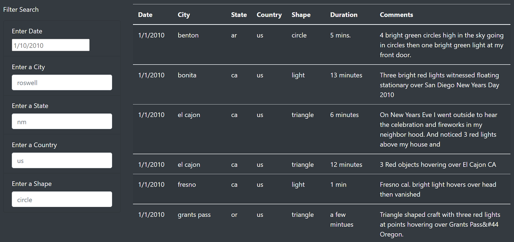
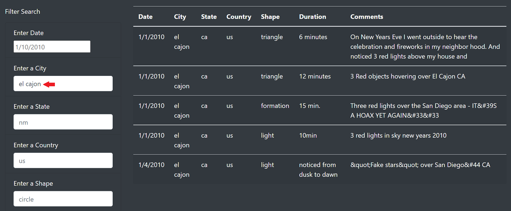
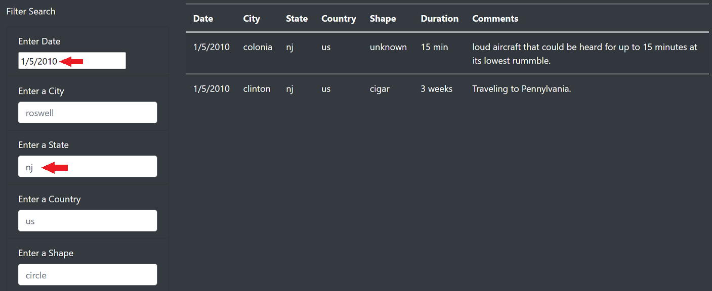

# UFOs
Website displaying a filterable UFO sighting database

## Overview of Project: 
The purpose of this project is to create a website that allows users to search a database of UFO sightings. There are not any other features and the site is only a single page so it can be thought of as a ufo sightings 'dashboard'. Visiters will be able to go to the site, filter the table by data, city, state and other criteria and see the results automatically display to the right of the filter form (once they click out of the input box).

## Results: 

The website/dashboard is designed to be easy to use, and modern internet users should intuitively know how to use the dashboard and filter the results. After scrolling down past the header and short introductory text on UFO sightings, the user arrives at the interactive table. In it's default state, all the contents of the table are shown, the top of which looks like the picture below.

On the left side are the input areas for the filters and on the right the resulting table. If one is to enter some valid input (or input that matches anything in the table) and clicks out of the text entry area, they will see the table automatically filter for matching rows. See below how the table filters for city when El Cajon (in this case 'el cajon' because all data in the database is currently lowercase) is entered.

If one wants to filter by more than one criteria they can, below we can see the result of filtering by state and date.

## Summary: 

This design works well, and could be used for other dashboards as well, however it is not without drawbacks and has potential for further development.

One (serious) drawback is the lack of user input control. The data in the table is lowercase, and all input must be lowercase as well. Most users will be entering city and state names as proper nouns and if they don't realize this they may think there were no sightings in the states and cities they search for. There is no reason for maintaining any case sensitivity and easy solutions are available.

One of a couple options for future development would be allowing the user to keyword search the comments section. The comments are not standardized and appear to be pretty much raw user input, but if one was doing a deep dive into this topic and was using this database, it may be useful to search for certain details that are not included in the other columns (color, number of lights, noise level). This could be implemented by using regular expressions and searching each row for results.

Another option would be to allow users to submit their sightings to be added to website. While it may not be wise to allow users to add directly to the table, a form at the bottom of the page could populate a file for review somewhere and periodically the new entries could be verified and added. This would allow the data to come to us and help with the arduous task of data mining and cleaning to expand the database.

